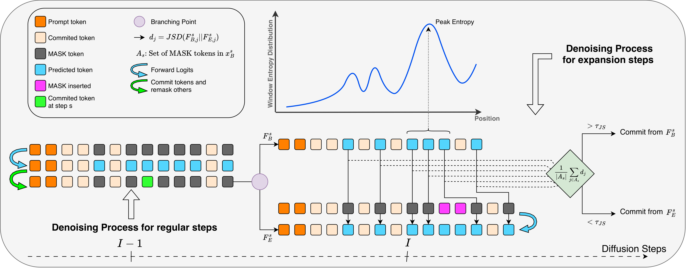

<div align="center">

# CARVE : Verified Expansion for Variable-Length Generation in Diffusion Language Models

### **C**ounterfactual-**A**ware **R**eveal with **V**erified **E**xpansion

[](https://arxiv.org/abs/2608.30922)

Wail Bouhedja · Amr Mohamed · Guokan Shang

🎉 **Accepted to Findings of EMNLP 2026**

</div>

<p align="center">
  
</p>

<p align="center">
  <em>At an expansion step, CARVE branches the canvas. It compares the base predictions <code>F<sub>B</sub></code>
  against the expanded ones <code>F<sub>E</sub></code> on the aligned unresolved positions, and commits from the
  expanded canvas only when their mean Jensen–Shannon divergence stays below <code>τ<sub>JS</sub></code>.</em>
</p>

---

## ✨ What is CARVE?

Masked diffusion language models decode into a **canvas of `[MASK]` positions whose size is fixed before
generation even begins** — and picking that size is a lose-lose. Too short truncates the reasoning or the
function body. Too long burns compute and perturbs denoising.

CARVE makes the canvas grow *during* decoding, and it is **training-free** — no finetuning, no new
parameters, no changes to the model.

Starting from a shorter canvas, CARVE periodically proposes inserting extra `[MASK]` positions. Instead
of trusting every insertion, it asks a **counterfactual question**:

> *Would the model predict roughly the same things at the unresolved positions if this extra masked space
> were there?*

If yes — low JS divergence on the aligned positions — the expansion is **kept**. If not, it is **discarded**
and decoding continues on the original canvas. Length growth becomes a *verified stability decision*
rather than a confidence heuristic.

**The payoff:** CARVE matches average accuracy over fixed-length baselines across every evaluated model
family, *while spending less compute* — down to **half the FLOPs** of fixed-length decoding in some
settings. It works on both full-canvas and blockwise diffusion decoders.

---

## 🚀 1. Install

A SLURM cluster whose GPU nodes have 8 AMD GPUs each (ours were MI210).

```bash
conda create -n carve python=3.12 -y && conda activate carve
pip install torch==2.9.1 --index-url https://download.pytorch.org/whl/rocm6.3
pip install -r requirements.txt
```

## ▶️ 2. Reproduce

From a login node, with the environment activated:

```bash
bash reproduce.sh
```

This downloads the benchmarks and submits all 36 cells — one SLURM job array per cell, each array task a
node with 8 GPUs, plus a merge job that runs when the array finishes. 4 nodes per HumanEval cell, 16 for
MBPP, MATH-500 and GSM8K.

A failed cell is independent and can be resubmitted on its own:

```bash
python scripts/run.py --method carve --model dream --task humaneval
```

Per-shard logs land in `outputs/benchmarks/<task>/table1/<method>__<model>/shards/`, SLURM logs in
`jobs/logs/`.

## 📋 3. Print the table

Once the queue drains:

```bash
python scripts/table1.py            # the table
python scripts/table1.py --latex    # LaTeX source
python scripts/table1.py --flops    # Figure-2 FLOPs ratios
```

Cells that have not run yet print as `--`, so a partial sweep stays visible instead of being silently
averaged away.

---

## 🧪 The recipe

Everything lives in [`benchmark/_shared/paper_config.py`](benchmark/_shared/paper_config.py).

| Model | canvas `Lmax` (HE / MBPP / MATH / GSM) | temp | block | `w` | `I` |
|---|---|---|---|---|---|
| Dream-v0-Instruct-7B | 128 / 256 / 512 / 256 | 0.04 | full | 12 | 16 |
| LLaDA-1.5 | 512 / 512 / 512 / 512 | 0.05 | 32 | 4 | 1 |
| LLaDA-8B-Instruct | 512 / 256 / 512 / 512 | 0.03 | 64 | 8 | 1 |

CARVE starts at `L0 = Lmax/2` and grows to `Lmax`; `steps = Lmax`. All three methods of a model decode at
the same temperature.

Each run records its resolved settings in `run_config.json`.

---

## 📝 Citation

```bibtex
@misc{bouhedja2026carveverifiedexpansionvariablelength,
      title={CARVE: Verified Expansion for Variable-Length Generation in Diffusion Language Models}, 
      author={Wail Bouhedja and Amr Mohamed and Guokan Shang},
      year={2026},
      eprint={2608.30922},
      archivePrefix={arXiv},
      primaryClass={cs.AI},
      url={https://arxiv.org/abs/2608.30922}, 
}
```
